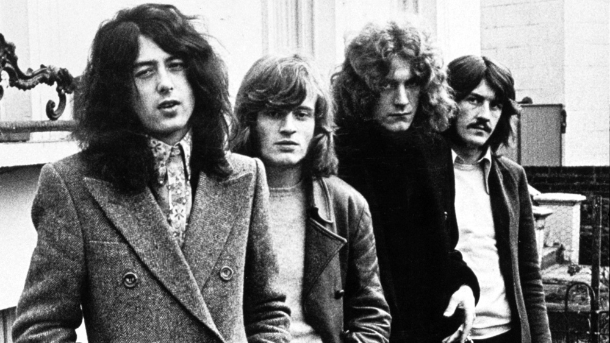

Personal Favorite 70's Rock Band
================================

Led Zeppelin
------------

[#f1]_

About
-----

Led Zeppelin was a British band that was started in 1968. The band consisted of
vocalist Robert Plant guitarist Jimmy Page Bassist/keyboardist John Paul Jones and
Drummer John Bonham. The Band also split up in 1980.Led Zeppelin is considered by many
critics as the most innovative and influential bands in rock history. The Band had nine
studio albums and all nine albums made it into the Billboard top 10 with six of their
albums receiving the first spot. They are the third best selling band in U.S. history. The
band was also inducted into the Rock and Roll Hall of Fame in 1995.

+------------------------+---------------------------------------------------------------------+-----------------------------------+----------+
| Favorite Album by the  | Led                                                                 | .. image:: led_zeppelin_album.png | Released |
| Artist                 | Zeppelin                                                            |     :width: 50%                   |  1969    |
|                        |                                                                     | [f2]_                             |          |
+------------------------+---------------------------------------------------------------------+-----------------------------------+----------+
| Favorite Song by the   | `Achilles Last Stand`_                                              |  First song on the Album          | Released |
| Artist                 | .. _Achilles Last Stand: https://www.youtube.com/watch?v=1t4KLOm7pO0|    Presence                       |  1976    |
|                        |                                                                     |                                   |          |
+------------------------+---------------------------------------------------------------------+-----------------------------------+----------+

.. rubric:: Footnotes
.. [#f1] Barraclough, L. (2019, May 9). Cannes: Altitude Boards Led Zeppelin Feature Documentary From Bernard MacMahon. Retrieved from https://variety.com/2019/film/global/cannes-bernard-macmahon-led-zeppelin-feature-documentary-altitude-1203208613/.
.. [#f2] Led Zeppelin (album). (2019, November 15). Retrieved from https://en.wikipedia.org/wiki/Led_Zeppelin_(album).
