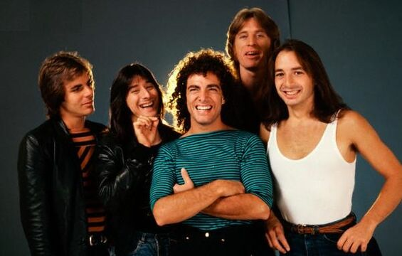

Personal Favorite 80's Rock Band
================================

Journey
-------

[#f1]_

About
-----

Journey was a band formed in San Francisco in 1973. The Band members consisted of lead vocalist
Steve Perry Lead Guitarist Neal Schon Lead Bassist Ross Valory Drummer Steve Smith and Keyboardist
Jonathan Cain. Their most successful album was Escape which reached the Billboard's number 1 spot.
They have the best selling song on Itunes not including 21st century releases. They have sold 48 million
albums in the United States and over 75 million records worldwide. They have also recieved 1 diamond
and 10 platinum albums in their history They were also inducted into the Rock and Roll Hall of Fame
in 2017. Personally I picked this band for my favorite of the decade because of their unique sound
when compared to other band of the 80's. Most of the rock bands of the 80's were hair bands that had
loud guitars where as Journey really focused on the vocals and had a nice contrast between the
different instruments.

Honorable Mention Favorite Songs
--------------------------------

* Don't Stop Believin'

* Faithfully

* Separate Ways (World's Apart)

+------------------------+-------------------------------------------------------------+----------------------------------------+----------+
| Favorite Album by the  | Escape                                                      | .. image:: JourneyEscapealbumcover.jpg | Released |
| Artist                 |                                                             |     :width: 50%                        |  1981    |
|                        |                                                             |                                        |          |
|                        |                                                             | [#f2]_                                 |          |
+------------------------+-------------------------------------------------------------+----------------------------------------+----------+
| Favorite Song by the   | `Open Arms <https://www.youtube.com/watch?v=3ByIYof4mqo>`_  |  Sixth song on the Album               | Released |
| Artist                 |                                                             |    Escape                              |  1981    |
+------------------------+-------------------------------------------------------------+----------------------------------------+----------+

.. rubric:: Footnotes
.. [#f1] Journey Band Wiki. (n.d.). Retrieved from https://journey-band.fandom.com/wiki/Journey_Band_Wiki.
.. [#f2] Escape (Journey album). (2019, November 6). Retrieved from https://en.wikipedia.org/wiki/Escape_(Journey_album).
