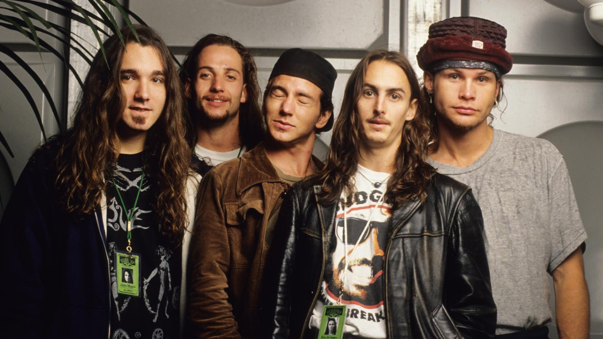

Personal Favorite 90's Rock Band
================================

Pearl Jam
---------

[#f1]_

About
-----

The Band Pearl Jam was founded in Seattle, Washington in 1990. It included Lead vocalist Eddie Vedder,
Lead Guitarist Mike McCready, Rythm Guitarist Stone Gosssard, Bassest Jeff Ament and drummer Matt
Cameron. Pearl Jam was a very influential band with the grunge movement in the 90s. Pearl Jam sold
over 32 million albums in the U.S. and over 85 million albums worldwide. Critics have even stated
that Pearl Jam was the most popular rock band of the 90's They were inducted into the Rock and
Roll Hall of Fame in 2017. I picked Pearl Jam as my favorite band of the 90's because when I think
of 90's music I think grunge. So when listening to Pearl Jam's music to me I think they best
accomplish the grudge sound. Just the way they play the guitar with the vocals of Eddie Vedder
and all the other instruments it just is straight up grunge.

Honorable Mention Favorite Songs
--------------------------------

* Alive

* Even Flow

* Black

+------------------------+------------------------------------------------------------+----------------------------------------+----------+
| Favorite Album by the  | Vs.                                                        | .. image:: PearlJam-Vs.jpg             | Released |
| Artist                 |                                                            |     :width: 50%                        |  1993    |
|                        |                                                            |                                        |          |
|                        |                                                            | [#f2]_                                 |          |
+------------------------+------------------------------------------------------------+----------------------------------------+----------+
| Favorite Song by the   | `Daughter <https://www.youtube.com/watch?v=jCjkNATSAr8>`_  |  Third song on the Album               | Released |
| Artist                 |                                                            |    Vs.                                 |  1993    |
+------------------------+------------------------------------------------------------+----------------------------------------+----------+

.. rubric:: Footnotes
.. [#f1] Haack, B. (2019, September 10). What's Your Favorite Track From Pearl Jam's 'Ten'? Retrieved from https://www.grammy.com/grammys/news/poll-once-release-whats-your-favorite-pearl-jam-track-ten.
.. [#f2] Vs. (Pearl Jam album). (2019, November 28). Retrieved from https://en.wikipedia.org/wiki/Vs._(Pearl_Jam_album).
