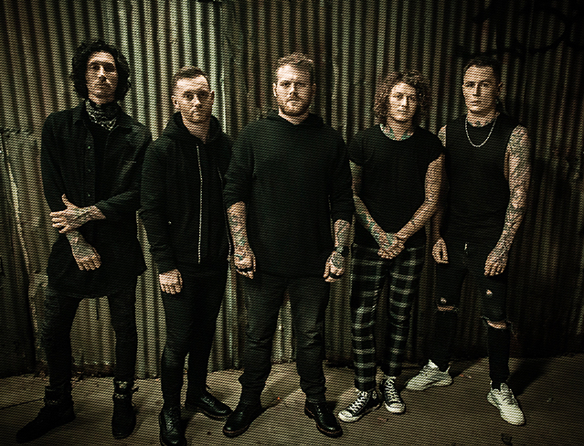

Asking Alexandria
=================

*Asking Alexandria* [#]_

About
-----
Asking Alexandria was formed in 2006 from York, North Yorkshire, England. The current members are Danny Worsnop(Lead Vocalist), Ben Bruce(Guitarist), Cameron Liddell(Guitarist), James Cassells(Drummer), and Sam Bettly(Bassist).

In 2006 the band members consisted of a different people except for Ben Bruce. Ben created the band in Dubai, United Arab Emirates. After his release of his first album in 2007 he knew they could achieve international success and went back to Nottingham, England in 2008. He got new members, but one eventually left in 2009 and Sam Betty was added.

*Stand up and Scream* was released in 2009. They signed to Sumerian Record. The album was only recognized in the US getting number 4 on Top Heatseekers, number 24 on Top Hard Rock Albums, and number 29 on Top Independent Albums. They toured across America and the Uk while releasing new albums and building popularity. In 2012 Worsnop tore his vocal cords, but they still released their third album *From Death to Destiny*. In 2015 Worsnop left the band to focus on a new band called We Are Harlot, but the band would continue touring. Later in 2016 Worsnop returned to the band.

Most Popular Albums
-------------------
* From Death to Destiny
* Reckless & Relentless
* The Black
* Asking Alexandria
* Stand Up and Scream

Awards
------
**Unfortunately Asking Alexandria as only received one reward through their entire career so far.**

Listen to their award winning album `Reckless & Relentless <https://www.youtube.com/watch?v=V32Q2n7TUfg&list=PL53F098204FB7E751>`_.

===== ===================== ==========================
Year  Album                 Award
===== ===================== ==========================
2012  Reckless & Relentless Best Metal/Hardcore Album
===== ===================== ==========================

.. rubric:: Footnotes

.. [#] Sumerian Records. (n.d.). Retrieved from http://www.sumerianrecords.com/artist/details/id:5/.