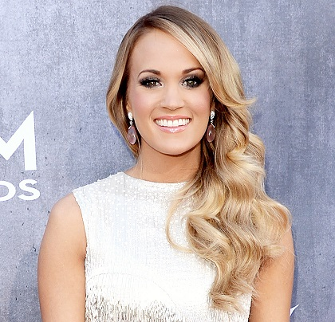

Carrie Underwood
=================

*Carrie Underwood* [#]_

**Biography**

Carrie Marie Underwood is a singer, songwriter,
fashion designer, and actress that was born on
March 10, 1983 in Muskogee, Oklahoma. As a child
she was diagnosed with ADHD. She also performed at
Robbins Memorial Talent show and sang at her local
church. At 14 it was arranged for her to audition
for Capitol Records, however management changed when a
contract was being prepared. She graduated salutatorian
of her high school and decided not to pursue music,
going to college and graduating magna cum laude with a
degree in mass communication.

She was the winner of the fourth season of *American
Idol* in 2005. Her music career started when she
released "Inside Your Heaven" in June 2005, which
debuted as No. 1 on the Billboard Hot 100. In 2005
she made an appearance on *The Oprah Winfrey Show* and
performed with the 2006 USO Christmas Tour in Iraq. She
released her second album *Carnival Ride* in 2007, where
she was more involved in the songwriting process. The
album sold over 527,000 copies in its first week. Her
success with this album made her the first solo female
artist to pull four number ones from one album since
Shania Twain did it with *The Woman in Me*. Underwood was
a co-writer for the lead single from *The Chronicles of
Narnia: The Voyage of the Dawn Treader* (2010) "There's a
Place for Us." In 2012, Carrie Underwood joined Steven
Tyler in recording CMT's Crossroads at the Pepsi
Coliseum during the Pepsi Super Bowl Fan Jam of
Super Bowl XLVI; it was the highest-rated episode in
seven years.

Her fourth album was released in May 2012, titled
Blown Away.The album was the seventh best-selling
album of 2012 and second best-selling country album.
She headlined the 2014 Concert For Valor alongside
other artists such as Eminem, Metallica, Foo Fighters,
and was backed during the performance of "Something in
the Water" by the US Air Force Singing Sergeants. She
finished her fifth album in 2015. The album's "Church
Bells" became her fifteenth career No. 1 on the Country
Airplay chart, extending her record of most number ones
on that chart for women. Her most recent album in *Cry
Pretty*, released in 2018 and it debuted as number one
in more than twenty countries.

**Awards**

===== =========================================================================================
Year  Award
===== =========================================================================================
2007: Country Music Association Award for Single of the Year ("Before He Cheats")
2007: Grammy Award for Best New Artist
2013: Grammy Award for Best Country Solo Performance ("Blown Away")
2014: CMT Music Award for Video of the Year ("See You Again")
2015: CMT Music Award for Video of the Year ("Something in the Water")
2015: Grammy Award for Best Country Solo Performance ("Something in the Water")
2018: Radio Disney Music Award: Special Hero Award
2019: CMT Music Award for Video of the Year ("Cry Pretty")
===== =========================================================================================

**Songs**

Songs by Underwood include:

* "Jesus, Take the Wheel" (2005)
* "Before He Cheats" (2005)
* "Ever Ever After" (used in 2007 movie *Enchanted*)
* "Temporary Home" (2009)
* "Good Girl" (2012)
* "Dirty Laundry" (2015)
* "Cry Pretty" (2018)

.. rubric:: Footnotes

.. [#] Merrit, Jason (Photographer). (2014). Retrieved from `USA Today <https://www.usmagazine.com/stylish/news/carrie-underwood-makeup-2014-acm-awards-201474/>`_