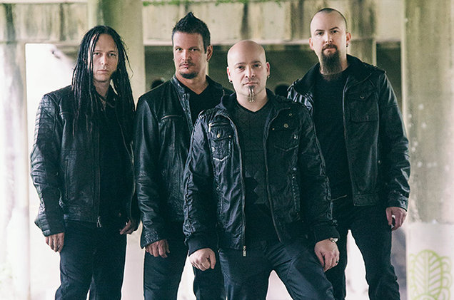

Disturbed
=========

*Disturbed* [#]_

About
-----
Disturbed formed in 1994 at Chicago, Illinois. The band’s current members are David Draiman(Lead Vocalist), Dan Donegan(Guitarist/Keyboardist), John Moyer(Bassist), and Mike Wengren(Drummer).

Before Draiman joined Disturbed the others were in a band called Brawl. When Brawl’s lead singer left they advertised for a new singer. Draiman went to the audition and Donegan was very impressed by his performance. Draiman joined the band in 1996 with bands new name Disturbed.

The band has made and released seven albums, five of them hit number one on the Billboard 200 multiple times. Disturbed paused in October 2011 due to the band members focusing on side projects. They returned in 2015, they released the album *Immortalized* on August 21, 2015. They released a live album *Disturbed: Live at Red Rocks* in November 2016. The seventh album was *Evolution* was on October 19, 2018.

Most Popular Albums
-------------------
* Ten Thousand Fists
* Immortalized
* Indestructible
* Believe
* Asylum

Awards
------

Listen to one of their award winning songs `The Vengeful One <https://www.youtube.com/watch?v=8nW-IPrzM1g>`_, `Down With The Sickness <https://www.youtube.com/watch?v=JKmmGegan64>`_, or `The Sound of Silence <https://www.youtube.com/watch?v=u9Dg-g7t2l4>`_.

===== ============================= ===================================
Year  Nominee/Album/Songs             Awards
===== ============================= ===================================
2015  Song: The Vengeful One        Video Countdown Hall of Fame
      Disturbed                     Classic Cage Match Hall of Fame

2016  Song: Down with the Sickness  Best Metal Song of the 21st Century
      Disturbed                     Artist of the Year

2017  Song: The Sound of Silence    Best Rock Video
===== ============================= ===================================

.. rubric:: Footnotes

.. [#] Graff, G. (2015, June 23). Disturbed Returns After Four-Year Hiatus with New Album 'Immortalized': Exclusive Interview. Retrieved from https://www.billboard.com/articles/columns/rock/6605697/disturbed-returns-after-four-year-hiatus-with-new-album-immortalized.

