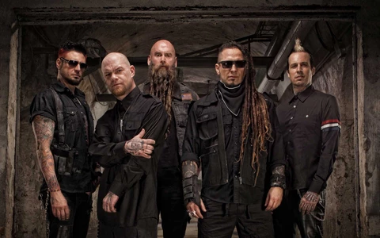

Five Finger Death Punch
=======================

*Five Finger Death Punch* [#]_

About
-----
Five Finger Death Punch is an American heavy metal band that is from Las Vegas, Nevada. The current band members are Zoltan Bathor(Lead/Rhythm Guitar), Ivan Moody(Lead Singer), Jason Hook(Lead Guitar/Backing vocals), Chris Kael(Bass Guitar/Backing Vocals), and Charlie Engen(Drums).

The band formed in 2005 and the name came from a kung fu cinema. In 2006 they released their very first album called *The Way of the Fist* and was featured in Billboard 200 at number 199. The second ablum was *War Is the Answer* which was released in May 2009. The album was featured in Billboard 200 and got number 7 and was certified platinum by RIAA. The album also sold over 1,000,000 copies.  In 2011 *American Capitalist* album was released. This album achieved Gold status within a year. Later on, *The Wrong Side of Heaven and the Righteous Side if Hell Vol 1 and 2* (2013) and *Got Your Six* (2015) achieved gold, which made the band one of the most successful heavy metal bands of the decade.

Most Popular Albums
-------------------
* Got Your Six

* The Wrong Side of Heaven And The Righteous Side of Hell: Vol. 1

* The Wrong Side of Heaven And The Righteous Side of Hell: Vol. 2

* And Justice For None

* American Capitalist

Awards
------

Listen to one of their award winning songs `Wrong Side of Heaven <https://www.youtube.com/watch?v=o_l4Ab5FRwM>`_, `Coming Down <https://www.youtube.com/watch?v=ptzzU7jFQwo>`_, or `Lift Me Up <https://www.youtube.com/watch?v=bLa-KyWT67E>`_.

==== =========================== =========================
Year Nominee/Song/Album               Awards
==== =========================== =========================
2009 Five Finger Death Punch     Best New Band

2010 Five Finger Death Punch     Best Breakthrough Band

     Zolton Bathory              Best Shredder
2011 Five Finger Death Punch     Indie Artist of the Year

2012 Jeremy Spencer              Best Drummer

     Five Finger Death Punch     Indie Artists of the Year

     Album: American Capitalist  Album of  the Year

     Song: Coming Down           Song of the Year
2013 Five Finger Death Punch     Indie Artists of the Year

2014 Chris Kael                  Best Bassist
     Song: Lift Me Up            Song of the Year

     Five Finger Death Punch     Indie Artist of the Year

     Song: Wrong Side of Heaven  Video of the Year

     Album: Wrong Side of Heaven Best International Album

     Five Finger Death Punch     Best International Group

     Five Finger Death Punch     Best Live Band
2015 Five Finger Death Punch     Artist of the Year

     Jeremy Spencer              Best Drummer

2016 Five Finger Death Punch     Best International Artist

2019 Five Finger Death Punch     Best International Artist

     Album: And Justice For None Best International Album
==== =========================== =========================

.. rubric:: Footnotes

.. [#] Five Finger Death Punch - New Songs, Playlists & Latest News - BBC Music. (n.d.). Retrieved from https://www.bbc.co.uk/music/artists/7e8571b1-7c5a-4739-bc51-73d422ee9d74.

