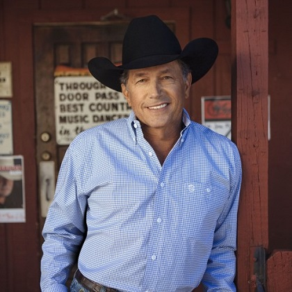

George Strait
==============

*George Strait* [#]_

**Biography**

George Strait is a country music singer, songwriter,
actor, and music producer known as a king of country
music, with a successful music career lasting more
than thirty years. He shattered the indoor concert
attendance record in North America in 2014 with
nearly 105,000.

Strait was born on May 18, 1952 in Poteet, Texas.
His interest in music began while in high school,
when he played in a rock and roll garage band as the
Beatles were popular around that time. After high
school he enlisted in the military and began
performing with an Army-sponsored band called
"Rambling Country," playing off-base as "Santee."
While he has been active since 1971, his success
started with "Unwound" when it became a hit in 1981.

Strait was named 2018 Texan of the Year by the
Texas Legislative Conference. He is also a cousin
to Jeff Bezos, the CEO, chairman, and founder of
amazon.com. His net worth is about $300 million [#]_.

**Awards**

===== =========================================================================================
Year  Award
===== =========================================================================================
1985: Top Male Vocalist - Academy of Country Music
1995: Single of the year ("Check Yes or No") - Academy of Country Music
2000: Song of the year ("Murder on Music Row" with Alan Jackson) - Country Music Association
2004: Hall of Fame - Cheyenne Frontier Days
2006: Honorary Doctoral Degree - Texas State University-San Marcos
2017: Cliffie Stone Icon Award - Academy of Country Music
===== =========================================================================================

**Songs**

Songs by Strait include:

* "Amarillo by Morning" (1982)
* "Check Yes or No" (1995)
* "I Can Still Make Cheyenne" (1996)
* "All my Ex's Live in Texas" (1987)
* "Condigo" (2018)
* "Give It All We Got Tonight" (2013)
* "The Weight of the Badge" (2019)

.. rubric:: Footnotes

.. [#] Retrieved from `SoundCloud <https://soundcloud.com/george-strait-music>`_
.. [#] Lisa, A. (2019, April 24). "The 30 Richest Country Music Stars, Ranked." Retrieved from `GO Banking Rates <https://www.gobankingrates.com/net-worth/celebrities/richest-country-music-stars/>`_.