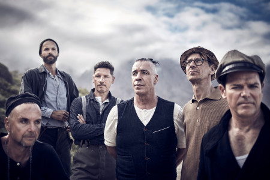

Rammstein
=========

*Rammstein* [#]_

About
-----
Rammstein is from Berlin, Germany and was formed in 1994. The current and unchanged band members are Till Lindemann(Lead Vocalist), Richard Kruspe(Lead Guitarist), Paul Landers(Rhythm Guitarist), Oliver Riedel(Bassist), Christoph Schneider(Drummer), and Christian Lorenz(Keyboardist).

After winning a local contest, Rammstein was able to record demos. They sent them to different record labels. They signed with Motor Music. They released their first album called *Herzeleid* in 1995. It did not sell very many but they gained popularity through live shows. The second album called *Sehnsucht* was released in 1997 and became number 1 in Germany. This lead to them going on a world tour lasting almost four years. After their tour they kept making multiple albums with songs that had them gain popularity. Some of the songs include *Sonne* (Number 2 in Germany), *Reise Reise*, *Mein Teil* (Number 2 in Germany), and *Amerika* (Number two in Germany). The band has a total of 39 awards.

Most Popular Albums
-------------------
* Rammstein
* Leibe Isdt Fur Alle Da
* Rosenrot
* Made in Germany

Awards
------
**The table below shows awards from 2010 to 2017 due to how many awards they have.**

Listen to their award winning song, that's in German, `Ich Tu Dir Weh <https://www.youtube.com/watch?v=IxuEtL7gxoM>`_.

==== ===================== ===========================================
Year Nominee/Albums/Song   Awards
==== ===================== ===========================================
2010 Rammstein             Best Rock/Alternative/Heavy Metal National

                           Kerrang! Inspiration AWard

                           Best Selling Artists Around the World
2011 Song: Ich Tu Dir Weh  Best Video National

     Song: Mein Land       Video of the Year

     Rammstein             Best Live-Band
2012 Rammstein             Most Successful National Abroad

                           Best German Band
2017 Rammstein             Best Live Concert
==== ===================== ===========================================

.. rubric:: Footnotes

.. [#] Grow, K. (2019, May 18). Rammstein Tussle With Germany's Past, Embrace Their Own Darkness on Self-Titled Album. Retrieved from https://www.rollingstone.com/music/music-album-reviews/rammstein-tussle-with-germanys-past-embrace-their-own-darkness-on-self-titled-album-835717/.
