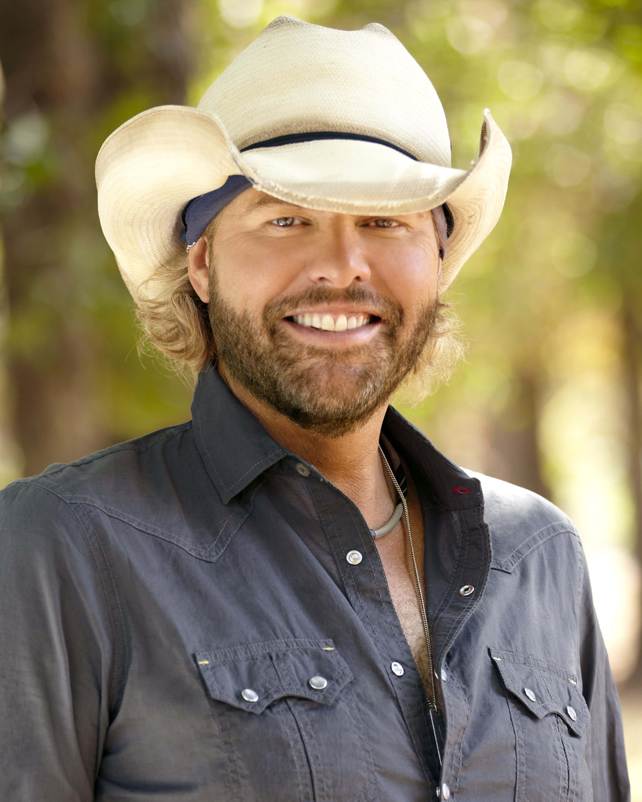

Toby Keith
===========

**Biography**

Tony Keith, born on July 8, 1961, is a singer,
songwriter, actor, and producer from Moore, Oklahoma.
Keith mostly does vocals and guitars in his songs.
Prior to a career in music, he worked in the oil fields.
At 20 years old he created the Easy Money Band with
friends and performed at local bars on top of his oil
work.

Keith's debut single was "Should've Been a Cowboy"
reached number one on the U.S. *Billboard* Hot Country
Songs chart in 1993 and became the most played song
in the 90s. According to a 2013 Forbes article,
Toby Keith is worth about $500 million [#]_.

**Awards**

Toby Keith gas been the recipient of several awards, such as:

* Country Music Association Awards

  * 2001: Male vocalist of the year
  * 2012: Music Video of the Year ("Red Solo Cup")

* Academy of Country Music Awards
  * 2000: Album of the Year ("How Do You Like Me Now")
  * 2003: Video of the year ("Beer For My Horses")

* American Music Awards
  * 2003 and 2005: Favorite Country Male Artist

**Songs**

Songs by Toby Keith include:

* "Should've Been a Cowboy" (2003)
* "American Soldier" (2003)
* "Beer For My Horses" (2002)
* "As Good As I Once Was" (2005)
* "Courtesy of the Red, White, and Blue" (2002)
* "Red Solo Cup" (2011)

.. rubric:: Footnotes

.. [#] https://www.forbes.com/sites/zackomalleygreenburg/2013/06/26/toby-keith-cowboy-capitalist-countrys-500-million-man/#35694bd8f930

